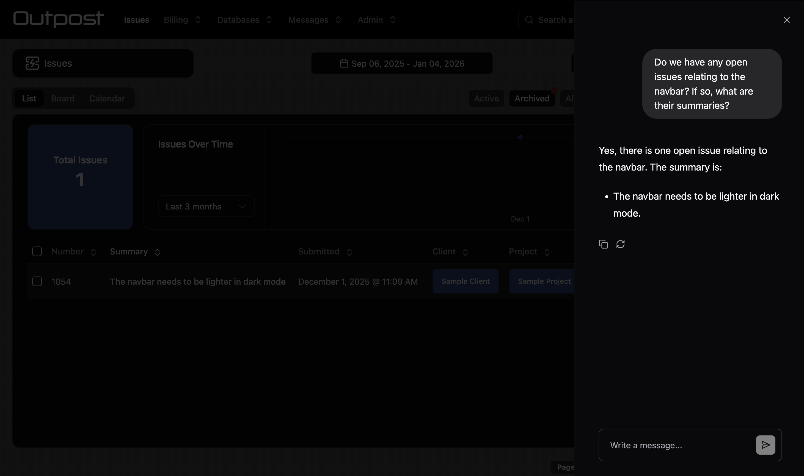
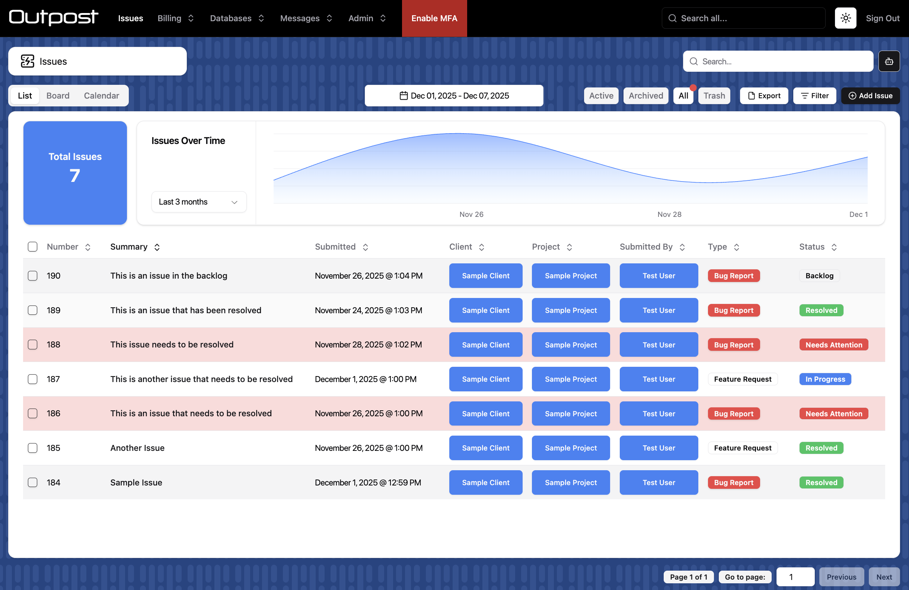
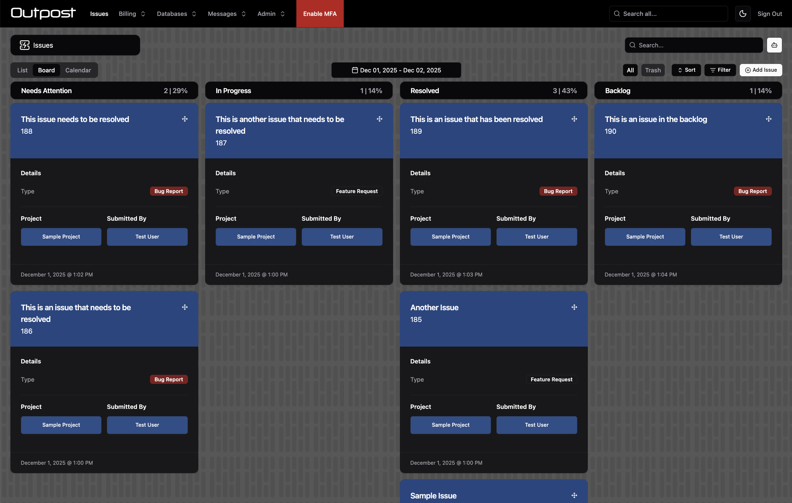
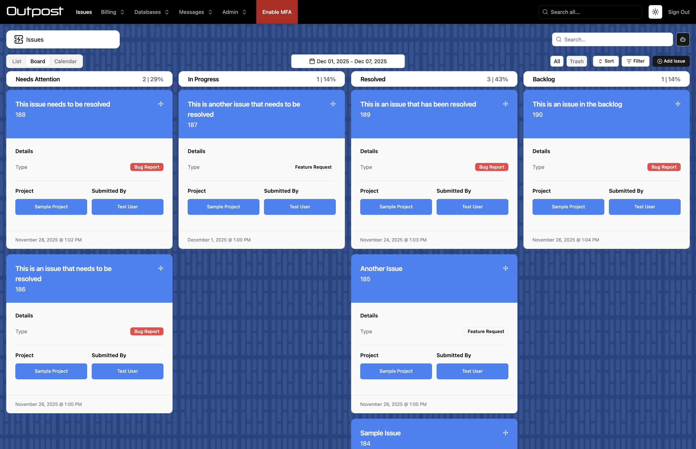
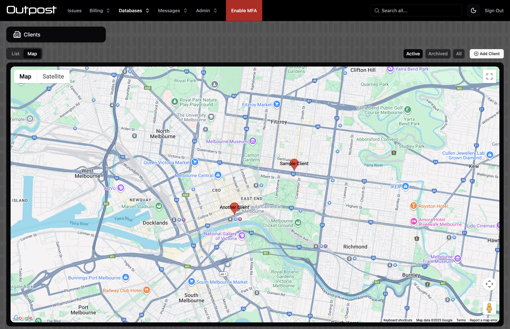
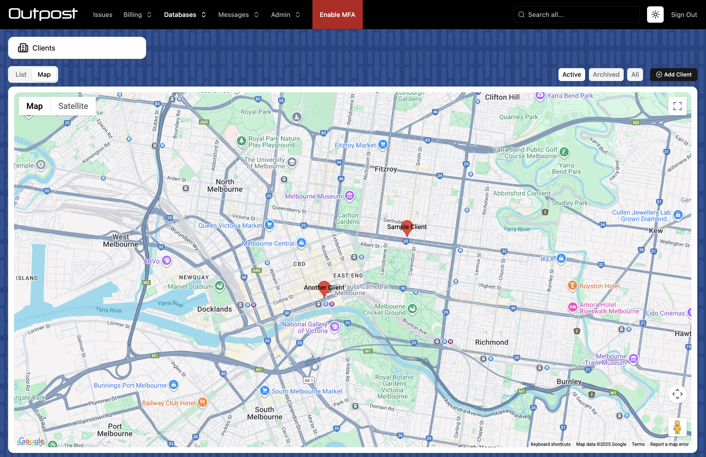

In Stoker, you define "collections" for your data. In other systems, these might be referred to as "tables", "objects" or "entities".

Each collection represents a collection in Cloud Firestore, and a page in the Admin UI.

Each collection in stoker has its own file in `src/collections`.

The following are the options for each collection file.

You can use [application state](/docs/api-reference/Application%20State) and the [Web](/docs/api-reference/Web%20SDK) and [Node](/docs/api-reference/Node%20SDK) SDKs in your config files.

## General Collection Config

### labels

`{ collection: string, record: string }`

These are the names for the collection. They cannot contains spaces (use underscores), but you can provide a user-friendly set of labels in [`admin.titles`](#titles).

`collection`: The name for the collection, i.e. "Clients".

`record`: The name for a record in the collection, i.e. "Client".

### recordTitleField

`string`

The field in the collection that will be used as the record's title i.e. "Name".

### auth

`boolean`

Set to `true` if this collection is a "users" collection.

When set to true, records in the collection can be assigned access credentials.

### singleton

`boolean`

Set to `true` if the collection will only have one record / page i.e. "Settings"

When set to `true`, no list page will be shown in the Admin UI. The user will be sent straight to the form page for the single record in the collection.

### parentCollection

`string`

This is an advanced option. Set to the collection's parent collection if this collection will be a subcollection in Firestore. Subcollections are not currently supported in the Admin UI.

### softDelete

`{ archivedField: string, timestampField: string, retentionPeriod: number }`

Enable soft-delete for this collection. 

`archivedField`: Provide the name of a Boolean field. This field will be set to `true` when the record is soft-deleted. 

`timestampField`: Provide the name of a Timestamp field. This field will be set to the current time when the record is soft-deleted.

`retentionPeriod`: The number of days after which soft-deleted records will be permananently deleted.

### fullTextSearch

`string[]`

An array of field names. These fields will be searchable.

For collections without `preloadCache` or `serverReadOnly` set to `true`, you will need to set up [Algolia](https://www.algolia.com/). Steps:

- Create an Algolia application for your app.
- Create an index for the collection in your Algolia app, using the exact collection name.
- Set searchable attributes for your index (in the "Configuration" section of the index). These attributes should match the fields provided to `fullTextSearch`.
- Set facets for your index (in the "Configuration" section of the index). The `tenant_id` attribute is required. You will also need to add any fields that your app uses to query records in the collection. This usually means all fields used for [filters](#filters) in the admin app, and all fields used for [attribute restrictions](Collection%20Config%20Files#attributerestrictions). So, if your app filters the collection by "Status", add a "Status" attribute to the facets section.

### searchOptions

`Record<string, unknown>`

Client-side full text search options. Only relevant for roles with the [preload cache](#preload-cache-config) enabled. Provide [MiniSeach settings](https://lucaong.github.io/minisearch/types/MiniSearch.SearchOptions.html).

### relationLists

`{ collection: string, field: string, roles?: string[] }[]`

Define "child lists" that will appear in the Admin UI for records in this collection.

For example, a "Clients" collection might have lists of related "Sites", "Quotes" and "Invoices" on its record page.

`collection`: The collection for the relation list

`field`: The field in the current collection that relates to the collection above.

`roles`: The roles that can see this relation list

### enableWriteLog

`boolean`

Set to `true` to enable the write log for this collection. Every write to a record will be logged in Firestore, creating a history that can be used for data recovery and audit purposes.

### indexExemption

`boolean`

Set to `true` to exempt this collection from Firestore indexing. Indexes that are reqiuried for your app to function will be re-added automatically. This feature improves performance and reduces costs by minimizing the number of indexes in your database. However, it may prevent you from running queries outside of the standard queries used by your app, for example when performing manual back end data operations.

### roleSystemFields

`{ field: string, roles?: string[] }[]`

By default, the following system fields are not accessible to your app's users:

- `Created_At`
- `Saved_At`
- `Created_By`
- `Last_Write_At`
- `Last_Save_At`
- `Last_Write_By`
- `Last_Write_App`
- `Last_Write_Connection_Status`
- `Last_Write_Version`

You can make them accessible by defining an array of objects containing the name of a field and the roles that can access that field.

:::note
`Saved_At` and `Last_Save_At` are safely generated on the server. `Created_At` and `Last_Write_At` are set on the client, and may not be reliable. The purpose of these fields is to log when offline writes occured.
:::

### allowSchemalessFields

`boolean`

Set to `true` to allow fields that are not defined in the schema to be written to records in the collection.

### ttl

`string`

The name of a [Timestamp field](#timestamp-field-properties) containing an automatic deletion date for the record i.e. `"Expires_At"`

:::warning
Denormalized data is not currently deleted by TTL policies, making it unsuitable for deleting data for privacy purposes.
:::

### skipRulesValidation

`boolean`

Collections with many fields may hit the limit of 1000 expressions per request allowed by Firestore Security Rules. If you see this error you can set this property to true to skip rule validation of writes. Validation will be run post-write in a Cloud Function, and you will get an email if invalid data is submitted.

This option can be [set at the field-level](#skiprulesvalidation-1) if you only want to skip rule validation for a subset of fields.

Alternatively, you can set [`access.serverWriteOnly`](#serverwriteonly) to true. This will force all writes to go through the server, validating all fields. The downside of this method is that your app will not be able to perform offline writes.

### seedOrder

`number`

The priority of this collection when seeding test data using [`stoker seed-data`](/docs/api-reference/CLI#seed-data-options).

### queries

```
{
    field: string
    range?: boolean
    standalone?: boolean
    roles?: string[]
}[]
```

:::warning
This is an advanced option that is only relevant if you are using Stoker as a headless CMS. This option is handled automatically by the Admin UI.
:::

Define fields that will be indexed for querying.

`field`: The name of the field.

`range`: Set to `true` if the field is a Timestamp field.

`standalone`: Set to `true` if the field needs to be indexed independent of sorting.

`roles`: The user roles that will run the query.

### custom.autoCorrectUnique

`boolean | (() => boolean | Promise<boolean>)`

Return `true` to automatically rename duplicate records rather than throwing an error.

Only relevant when [`access.serverWriteOnly`](#serverwriteonly) is falsy.


### custom.disableOfflineCreate

`boolean | (() => boolean | Promise<boolean>)`

Return `true` to disable adding new records while offline.

### custom.disableOfflineUpdate

`boolean | (() => boolean | Promise<boolean>)`

Return `true` to disable updating records while offline.

### custom.disableOfflineDelete

`boolean | (() => boolean | Promise<boolean>)`

Return `true` to disable deleting records while offline.

## Collection Access Config

Access config is specified using the `access` property.

### serverReadOnly

`string[]`

An array of roles that must read data via the server. This allows more granular access control (specified in `serverAccess` at the [collection](#customserveraccess) or [field](#customserveraccess-1) level).

:::warning
This option slows performance and removes offline and realtime capabilites, so it is not recommended unless you absolutely need more granular access control.
:::

### serverWriteOnly

`boolean`

Set to `true` to force writes through the server.

This option is required if your collection has fields that perform [two-way relation writes](#twoway).

This option is automatically enabled for collections with `auth` set to `true`.

:::warning
The above scenarios aside, we do not recommend enabling this option as it slows performance and removes offline write capablities.
:::

On the other hand, this option can greatly reduce the amount of Firestore Security Rules used by the collection. If you are exceeding the 256KB rules limit, you might consider enabling this option for collections that don't require offline writes.

### operations

```
{
    assignable?: boolean | string[]
    read?: string[]
    create?: string[]
    update?: string[]
    delete?: string[]
}
```

Define which roles can perform which CRUD operations for the collection.

Set `assignable` to `true` or an array of user roles to allow disabling of access in the user's profile.

### auth

`string[]`

A list of roles that can assign access credentials for this collection.

Only relevant when `auth` is set to true in the root collection config (above).

### Access Control Policies

Stoker allows you to set complex access control policies using simple config.

This config comes in the form of:

- "Attribute restrictions", which restrict a user's access to records with certain attributes.
- "Entity restrictions", where you explicitly define which specific records or groups of records can be accessed by a user. This assignment is done in the user's profile (by an Admin).

### attributeRestrictions

Provide an array of the following attribute restrictions:

#### Record Owner Restriction

Users will only be able to access records that they created themselves.

```
type RecordOwnerRestriction = {
    type: "Record_Owner"
    roles: { role: string, assignable?: boolean }[]
    operations?: ("Read" | "Create" | "Update" | "Delete")[]
}
```

`roles`: The roles that this restriction applies to. If `assignable` is set to true, this restriction can be removed for individual users.

`operations`: If provided, the restriction will only apply to the provided operations. The restriction will NOT be applied for unlisted operations.

#### Record User Restriction

Users will only be able to access records that they have been assigned to.

For example, if the collection has an "Assigned To" field, the user will only be able to access the record if they have been added to that field.

```
type RecordUserRestriction = {
    type: "Record_User"
    roles: { role: string, assignable?: boolean }[]
    collectionField: string
    operations?: ("Read" | "Create" | "Update" | "Delete")[]
}
```

`collectionField`: The field that will be used to assign access. Must be a relational field linked to a users collection.

`roles`: The roles that this restriction applies to. If `assignable` is set to true, this restriction can be removed for individual users.

`operations`: If provided, the restriction will only apply to the provided operations. The restriction will NOT be applied for unlisted operations.

#### Record Property Restriction

Users will only be able to access records that have specified values for a selected field.

For example, if the collection has a "Status" field, you can ensure that a user role only sees "Not Started" and "In Progress" records, but not "Completed" or "Archived" records.

```
type RecordPropertyRestriction = {
    type: "Record_Property"
    roles: { role: string, assignable?: boolean, values: string[] }[]
    propertyField: string
    operations?: ("Read" | "Create" | "Update" | "Delete")[]
}
```

`propertyField`: Must be a String field with `values` set.

`roles`: The roles that this restriction applies to, and which property values they can access.  If `assignable` is set to true, this restriction can be removed for individual users.

`operations`: If provided, the restriction will only apply to the provided operations. The restriction will NOT be applied for unlisted operations.

### entityRestrictions.restrictions

Provide an array of the following entity restrictions:

#### Individual Entity Restriction

Assign individual records to a user in their profile.

```
type IndividualEntityRestriction = {
    type: "Individual"
    roles: { role: string }[]
    singleQuery?: number
}
```

`roles`: The roles that this restriction applies to. If `assignable` is set to true, this restriction can be removed for individual users.

`singleQuery`: Advanced. Force read operations to get all records in a single API call.

#### Parent Entity Restriction

Assign all records for a parent record to a user in their profile. For example, you might assign a user "All Sites for Company X" or "All Tasks for Project X".

```
type ParentEntityRestriction  = {
    type: "Parent"
    roles: { role: string }[]
    collectionField: string
    singleQuery?: number
}
```

`collectionField`: The field that parent records can be selected from. Must be a relational field.

`roles`: The roles that this restriction applies to. If `assignable` is set to true, this restriction can be removed for individual users.

`singleQuery`: Advanced. Force read operations to get all records in a single API call.

#### Parent Property Entity Restriction

Assign all records for a parent record to a user in their profile, by attribute. For example, you might assign a user "All Sites for Company X in State NY" or "All Tasks for Project X assigned to Team B".

```
type ParentPropertyEntityRestriction = {
    type: "Parent_Property"
    roles: { role: string }[]
    collectionField: string
    propertyField: string
}
```

`collectionField`: The field that parent records can be selected from. Must be a relational field.

`propertyField`: The field that defines the attribute.

`roles`: The roles that this restriction applies to. If `assignable` is set to true, this restriction can be removed for individual users.

:::warning
Soft-deleting assigned records does not block access to them. See [`softDelete`](#softdelete).
:::

### entityRestrictions.assignable

`string[]`

An array of user roles for which entity restrictions can be disabled for individual users.

### entityRestrictions.parentFilters

This section lets you apply entity restrictions from a parent collection onto a child collection.

For example, you could assign a user access to "All Jobs on Sites for Company X in State NY" or "All Subtasks on Tasks for Project X assigned to Team B".

#### Individual Entity Parent Filters

Assign an individual entity restriction from a parent collection.

```
type IndividualEntityParentFilter = {
    type: "Individual"
    collectionField: string
    roles: { role: string }[]
}
```

`collectionField`: The relational field that links to the collection that the individual entity restriction is on.

`roles`: The roles that this parent filter applies to.

#### Parent Entity Parent Filters

Assign a parent entity restriction from a parent collection.

```
type ParentEntityParentFilter = {
    type: "Parent"
    collectionField: string
    parentCollectionField: string
    roles: { role: string }[]
}
```

`collectionField`: The relational field that links to the collection that the individual entity restriction is on.

`parentCollectionField`: The relational field that matches the parent entity restriction's collection field.

`roles`: The roles that this parent filter applies to.

#### Parent Property Entity Parent Filters

Assign a parent propery entity restriction from a parent collection.

```
type ParentPropertyEntityParentFilter = {
    type: "Parent_Property"
    collectionField: string
    parentCollectionField: string
    parentPropertyField: string
    roles: { role: string }[]
}
```

`collectionField`: The relational field that links to the collection that the individual entity restriction is on.

`parentCollectionField`: The relational field that matches the parent entity restriction's collection field.

`parentPropertyField`: The field that matches the parent entity restriction's property field.

`roles`: The roles that this parent filter applies to.

:::warning
When parent filters are used, the collection and property fields used in entity restrictions and parent filters should have updates disabled using [`restrictUpdate`](#restrictupdate). This is because you will likely be denormalizing data for these fields.
:::

### customSecurityRules

`boolean`

Set to `true` if you want to write custom Firestore Security Rules for the collection.

Custom security rules can be added at `firebase-rules/firestore.custom.rules`

You'll probably want to copy the generated security rules for modification before enabling this option.

### customStorageRules

`boolean`

Set to `true` if you want to write custom Firestore Storage Rules for the collection.

You'll probably want to copy the generated security rules for modification before enabling this option.

### permissionWriteRestrictions

`permissionWriteRestriction[]`

Stoker lets you restrict which permissions a user role can assign to other user roles. For example, imagine a scenario where you want:
- "Manager" users to be able to create any users with any permissions
- "Supervisors" to be able to create "Staff Member" users only. Additionally, Supervisors can only grant access to 3 selected collections and must apply certain attribute and entity restrictions on those collections.

This allows a flexible yet secure hierarchy of access assignment.

Your config should look like this:

```
type permissionWriteRestriction = {
    userRole: string
    recordRole: string
    collections: {
        collection: string
        operations: ("Read" | "Create" | "Update" | "Delete")[]
        attributeRestrictions?: ("Record_Owner", "Record_User", "Record_Property")[]
        restrictEntities?: boolean
        auth?: boolean
    }[]
}
```

`userRole`: The user role you are applying restrictions to.

`recordRole`: A role that the user above can assign access to.

`collections`: Define which operations and restrictions are to be applied for each collection.

### files

`AccessFiles`

You can define access rules for file uploads.

Your config should look like this:

```
type AccessFiles = {
    assignment?: {
        [role: string]: {
            optional?: {
                read?: string[]
                update?: string[]
                delete?: string[]
            }
            required?: {
                read?: string[]
                update?: string[]
                delete?: string[]
            }
        }
    }
    metadata?: {
        [key: string]: string
    }
    customMetadata?: {
        [key: string]: string
    }
}
```

`assignment`: Define the user roles that the user must assign access to for each file.

`metadata`: Enforce Firebase Storage metadata constraints.

`customMetadata`: Enforce custom metadata constraints.

For example:

```
{
    assignment: {
        Client: {
            required: {
                read: ["Manager, "Supervisor"]
                update: ["Manager, "Supervisor"]
                delete: ["Manager]
            }
        }
    },
    metadata: {
        size: " <= (5 * 1024 * 1024)",
        contentType: ' in ["application/octet-stream"]',
    },
    customMetadata: {
        collection: ' == "Work_Orders"',
    },
}
```

### custom.serverAccess

```
{
    read?: (role: string, record?: StokerRecord) => boolean | Promise<boolean>
    create?: (role: string, record: StokerRecord) => boolean | Promise<boolean>
    update?: (role: string, record: StokerRecord, originalRecord?: StokerRecord) => boolean | Promise<boolean>
    delete?: (role: string, record: StokerRecord) => boolean | Promise<boolean>
}
```

Define additional access control using code on the server.

Only relevant if [`access.serverWriteOnly`](#serverwriteonly) is set to `true`.

Return a boolean indicating whether or not the access check passed.

This code is not sent to the client.

## Preload Cache Config

You can preload data for your collections on app startup. Preloaded data is cached and is available for the lifetime of the session.

Since Stoker is primarily designed for enterprise applications, long sessions are common. It is also common for users to download the app onto the desktop as a PWA. 

Because long sessions are common, we encourage preloading data on app startup. This results in a snappy application that works offline thanks to cached data.

:::tip
We absolutely recommend using the preload cache for time series data. This will result in huge performance gains, more available features and fewer indexes used. You don't have to preload huge amounts of data if you don't want to.
:::

To enable preloading of data, use the `preloadCache` property.

For examples of this config, see the default Inbox and Outbox collections in your project (created by `stoker init`).

### roles

`string[]`

An array of user roles that will use the preload cache.

### relationCollections

`boolean | (() => boolean | Promise<boolean>)`

Whether to wait for related collections to load before signalling to the app that the collection is loaded.

### range

`PreloadCacheRange`

Use this option to preload a range of time-series data. The user will be able to update the preloaded range using a date picker in the Admin UI.

```
type PreloadCacheRange = {
    fields: string[]
    ranges?: [string, string][]
    labels?: string[]
    start: "Today" | "Week" | "Month" | "Year" | Date | number
    startOffsetDays?: number
    startOffsetHours?: number
    end?: Date | number
    endOffsetDays?: number
    endOffsetHours?: number
    selector?: "range" | "week" | "month" | ("range" | "week" | "month")[]
}
```

`fields`: An array of Timestamp fields in the collection that time-series data can be preloaded by. The user will be able to select which field to preload data by.

`ranges`: An array of ranges of data that can be preloaded. For example ["Start", "End"]. This will preload all data that overlaps with the range selected by the user. Fields used must also be defined in `fields` above.

`labels`: Human-readable labels for the `fields` listed above, if they are not already human-readable, i.e. the field names contain underscores.

`start`: The default start date for the preloaded range.

`startOffsetDays`: Offset the default start date by x days

`startOffsetHours`: Offset the default start date by x hours

`end`: The default end date for the preloaded range.

`endOffsetDays`: Offset the default end date by x days

`endOffsetHours`: Offset the default end date by x hours

`selector`: Whether the range picker should show the week, month or custom range selectors.

### constraints

`[string, WhereFilterOp, unknown][] | (() => [string, WhereFilterOp, unknown][] | Promise<[string, WhereFilterOp, unknown][]>)`

Additonal Firestore constraints to apply to the preload cache. This is an advanced option.

## Collection Fields Config

Fields are specified using the `fields` property.

`fields` must be an array of field objects. These objects are outlined below.

### General Field Properties

These properties can be set on any field type.

#### name

`string`

The name of the field. It must not have spaces (use underscores). You can set a human-readable name in [`admin.label`](#label).

#### access

`string[]`

An array of user roles that can access the field.

:::danger
Omitting the access property altogether allows access by ALL roles.
:::

#### restrictCreate

`boolean | string[]`

Set to `true` to prevent this field from being included when the record is created.

Alternatively, provide an array of user roles that CAN provide the field when creating a record.

#### restrictUpdate

`boolean | string[]`

Set to `true` to prevent this field from being changed when the record is updated.

Alternatively, provide an array of user roles that CAN change the field when updating a record.

#### required

`boolean`

Set to `true` if the field is a required field.

#### nullable

`boolean`

Set to `true` if the field is a nullable field.

#### sorting

`boolean | { direction?: "asc" | "desc" roles?: string[] }`

Specifies that this field will be used for sorting. Not required if all user roles have `preloadCache` or `access.serverReadOnly` enabled. In these cases, sorting is automatic.

Set to `true` to sort by "asc" and "desc" for all user roles, or provide the more granular config above.

:::warning
Specifying a sorting direction for a field in a collection without `preloadCache` or `serverReadOnly` set to `true` will result in the "Previous" page button being disabled. The "Back to start" button will still work.
:::

#### skipRulesValidation

Skip Firestore Security Rules validation for this field. This can help to keep the size of the security ruleset down. When this option is enabled, validation will be performed post-write in a Cloud Function. You will receive an email if invalid data has been submitted.

#### description

`string | (() => string | Promise<string>)`

A description for the field for LLMs. Only relevant if [`ai`](#ai-chat-config) is configured.

#### singleFieldExemption

```
{
    queryScope: "COLLECTION" | "COLLECTION_GROUP"
    order?: "ASCENDING" | "DESCENDING"
    arrayConfig?: "CONTAINS" | "CONTAINS_ANY"
}
```

Place a single field exemption on the field in Firestore.

If you have set `indexExemption` at the collection level, this option will re-enable indexing for the field.

You should consider exempting [incrementally increasing monotonic fields](/docs/advanced-google-cloud/Limitations#no-support-for-high-collection-write-rates-for-collections-with-sequential-indexed-values), large String fields, Map fields and Array fields. 

#### custom.initialValue

`unknown | ((record?: StokerRecord) => unknown | Promise<unknown>)`

Calculate an initial value for this field when creating the record.

#### custom.serverAccess

```
{
    read?: (role: string, record?: StokerRecord) => boolean | Promise<boolean>
    create?: (role: string, record: StokerRecord) => boolean | Promise<boolean>
    update?: (role: string, record: StokerRecord, originalRecord?: StokerRecord) => boolean | Promise<boolean>
}
```

Define additional access control using code on the server.

Only relevant if `access.serverWriteOnly` is set to `true`.

Return a boolean indicating whether or not the access check passed.

This code is not sent to the client.

### String Field Properties

#### type

`"String"`

#### values

`string[]`

An optional list of values. This will result in a dropdown list being shown in the Admin UI.

#### unique

Set to `true` to make the field a unique field. Be sparing with this option unless `access.serverWriteOnly` is set to true.

Case is ignored when determining whether or not a value is a duplicate.

:::tip
You can auto-rename duplicate values in the Web SDK using [`custom.autoCorrectUnique`](#customautocorrectunique). Note that this will append an identifier i.e. "DUPLICATE-1" to the end of the field value. Your field validation strategy will need to account for this identifier, or writes will be rejected.
:::

:::warning
Unique field values are NOT freed up when a record is [soft-deleted](#softdelete).
:::

#### length

`number`

Specify a fixed length for the field.

#### minlength

`number`

Specify a minimum length for the field.

#### maxlength

`number`

Specify a maximum length for the field.

#### pattern

`string`

Specify a regex pattern for the field.

#### email

`boolean`

Set to `true` if the field is an email address

:::warning
Emails are currently only validated server-side if you have `access.serverWriteOnly` set to true. You can alternatively use `pattern` above, which is always validated server-side.
:::

#### url

`boolean`

Set to `true` if the field is a url

:::warning
URLs are currently only validated server-side if you have `access.serverWriteOnly` set to true. You can alternatively use `pattern` above, which is always validated server-side.
:::

#### emoji

`boolean`

Set to `true` if the field is an emoji

:::warning
Emojis are currently only validated server-side if you have `access.serverWriteOnly` set to true. You can alternatively use `pattern` above, which is always validated server-side.
:::

#### uuid

`boolean`

Set to `true` if the field is a UUID

:::warning
UUIDs are currently only validated server-side if you have `access.serverWriteOnly` set to true. You can alternatively use `pattern` above, which is always validated server-side.
:::

#### ip

`boolean`

Set to `true` if the field is an IP address

:::warning
IP addresses are currently only validated server-side if you have `access.serverWriteOnly` set to true. You can alternatively use `pattern` above, which is always validated server-side.
:::

### Number Field Properties

#### type

`"Number"`

#### values

`number[]`

An optional list of values. This will result in a dropdown list being shown in the Admin UI.

#### unique

Set to `true` to make the field a unique field. Be sparing with this option unless `access.serverWriteOnly` is set to true.

:::warning
Unique field values are NOT freed up when a record is [soft-deleted](#softdelete).
:::

#### autoIncrement

`boolean`

Set to `true` to make the field an auto-incremented number.

:::info
Auto-incremented numbers are written by a Cloud Function after the record has been saved to the server. This means auto-incremented numbers made in offline mode won't appear until the user has reconnected.
:::

#### decimal

`number`

Set the maximum number of decimal places for this field.

#### min

`number`

Set the minimum number value for this field.

#### max

`number`

Set the maximum number value for this field.

### Timestamp Field Properties

#### type

`"Timestamp"`

#### values

`number[]`

An optional list of dates in milliseconds format. This will result in a dropdown list being shown in the Admin UI.

#### min

`number`

Set the minimum milliseconds value for this field.

#### max

`number`

Set the maximum milliseconds value for this field.

### Array Field Properties

#### type

`"Array"`

#### values

`string[]`

A list of values. A dropdown selector will be shown in the Admin UI.

#### length

`number`

Set the exact required length for this field.

#### minlength

`number`

Set the minimum length for this field.

#### maxlength

`number`

Set the maximum length for this field.

### Map Field Properties

#### type

`"Map"`

### Relational Field Properties

:::warning
Stoker records are limited to Firestore's per-document limits:
- 1MB max document size
- 40,000 max index enrtries

This limits the maximum number of relations you can have per document.
:::

#### type

`"OneToOne" | "OneToMany" | "ManyToOne" | "ManyToMany"`

#### collection

`string`

The collection for the relational field.

#### includeFields

`string[]`

Save fields from the related record to the target record. Field values will be denormalized and will automatically update when the source record is updated.

This architecture avoids the N+1 problem and gives you a snappy, offline-friendly app. The downside is that potentially large back-end write operations are required when values change. However, these write operations are automatically managed by highly scalable Cloud Functions in Stoker.

For examples of this config, see the "Sender" and "Recipients" fields in the default Inbox collection in your project (created by `stoker init`)

:::info
Updates to include fields are written by a Cloud Function after the source record has been updated on the server. This means include field updates made in offline mode won't appear until the user has reconnected.
:::

#### titleField

`string`

Choose one of the `includeFields` values above to act as the title field for the related record.

For examples of this config, see the "Sender" and "Recipients" fields in the default Inbox collection in your project (created by `stoker init`)

#### dependencyFields

`{ field: string, roles: StokerRole[] }[]`

Grant users access to the specified field in the related collection. For example, you could assign a user access to only the "ID" and "Name" fields in the related collection. This lets users select values from a dropdown without giving them full access to the related collection.

For an example of this config, see the "Recipient" field in the default Outbox collection in your project (created by `stoker init`)

:::info
Only records allowed by the user role's [access policy](#access-control-policies) for the related collection will be accessible.
:::

#### twoWay

`string`

Enable a two-way relation.

Provide the name of a relational field in the target collection to link with. The following link types are valid:

`OneToOne` > `OneToOne`

`OneToMany` > `ManyToOne`

`ManyToOne` > `OneToMany`

`ManyToMany` > `ManyToMany`

:::warning
`access.serverWriteOnly` must be enabled for this feature to work, which will result in the loss of offline write capabilities.
:::

:::warning
For two-way writes to work, the user must have write access to both the source record and the target record. Ensure that the user will have:

- Sufficient access to the target record's collection
- Sufficient access to the target record (ensure that [Access control policies](#access-control-policies) won't block access to the target record)
- Sufficient access to the target field ([`field.access`](#access))
:::

#### preserve

`boolean`

Set to `true` to preserve relation data when the related record is deleted.

:::warning
This may have privacy implications
:::

#### writeAny

`boolean`

Set to `true` to allow users to write any value to the relational field. By default, users can only write values for records that they have access to.

:::warning
This may have security implications
:::

#### constraints

`[string, "==" | "in", unknown][]`

Set [Firestore where() query](https://firebase.google.com/docs/firestore/query-data/queries#simple_queries) constraints that will be applied when retrieving records for the dropdown selector.

#### enforceHierarchy

`{ field: string, recordLinkField: string }`

Enforce the relational integrity of the field. For example, ensure that the record's "Site" is actually related to the record's "Company".

`field`: Another relational field in the collection that is above the current field in the relational hierarchy.

`recordLinkField`: The field in the field above's collection that has the same collection as the current field.

#### length

`number`

Set the exact number of relations required for this field.

#### min

`number`

Set the minimum number of relations for this field.

#### max

`number`

Set the maximum number of relations for this field.

:::info
When a record is deleted from Stoker, its relation values in other records are deleted. This happens in a Cloud Function, so deletions made in offline mode won't be visible until the user has reconnected.
:::

### Computed Field Properties

#### type

`"Computed"`

#### formula

`(record: StokerRecord, retrieverData?: any) => string | number | Promise<string | number>`

Calculates the value for the field.

When using `getSome` or `subscribeMany`, `retrieverData` will return the data provided by the collection's [`retriever`](#retriever) function. This lets you load data sets for your computed field formulas **once per query**.


### Field Admin UI Properties

Admin UI config is specified using the `admin` property.

#### label

`string | (() => string)`

A human-readable name for the field. Only necessary if `name` is not human-readable.

#### listLabel

`string | (() => string)`

Override the field name shown in the list view.

#### icon

`{ component: React.FC, className?: string } | (() => { component: React.FC, className?: string }  | Promise<{ component: React.FC, className?: string } >)`

An icon that will be shown for the field on the form page. Provide additional Tailwind classess using `className`.

#### condition

```
{
    list?: boolean | ((parentCollection?: CollectionSchema, parentRecord?: StokerRecord) => boolean)
    form?: boolean | ((operation?: "create" | "update", record?: StokerRecord) => boolean)
}
```

Show or hide the field in the list view and on the form page. 

The list function recieves the parent collection and parent record when shown on a relation list page.

#### hidden

`"sm" | "md" | "lg" | "xl" | "2xl" | ((record?: StokerRecord) => "sm" | "md" | "lg" | "xl" | "2xl")`

The screen size at which the field should be hidden from the list view. This is useful for responsiveness.

#### readOnly

`boolean | ((operation?: "create" | "update", record?: StokerRecord) => boolean | Promise<boolean>)`

Return `true` to set this as a read-only field in the Admin UI

#### sort

`(record?: StokerRecord) => unknown`

The returned value will be used for sorting in the list view.

#### column

`boolean | number | (() => boolean | number)`

Set the position of the field in the list and the form. Defaults to the position of the field in the fields array, so this option may not be necessary.

#### description

```
{
    message: string | ((record?: StokerRecord) => string | Promise<string>)
    condition?: boolean | ((record?: StokerRecord) => boolean | Promise<boolean>)
}
```

Display a conditoinal description message under the field in the Admin UI.

#### live

`boolean`

Set to `true` to have the field live-update on the form page when the record is updated remotely.


#### switch

`boolean | (() => boolean | Promise<boolean>)`

Set to `true` on a Boolean field to make it a switch

#### textarea

`boolean | (() => boolean | Promise<boolean>)`

Set to `true` on a String field to make it a textarea

#### richText

`boolean | (() => boolean | Promise<boolean>)`

Set to `true` on a Map field to make it a rich text field

#### italic

`boolean | ((record?: StokerRecord) => boolean)`

Set to `true` on a String field to make it italic

#### currency

`string | ((record?: StokerRecord) => string)`

Set to a currency symbol on a String field to make it a currency

#### radio

`boolean | (() => boolean | Promise<boolean>)`

Set to `true` on a String field with `values` to make it a radio group

#### slider

`boolean | (() => boolean | Promise<boolean>)`

Set to `true` on a Number field to make it a slider

#### time

`boolean | (() => boolean | Promise<boolean>)`

Set to `true` on a String field to make it a time field.

Set to `true` on a Timestamp field to make it a datetime field.

#### month

`boolean | (() => boolean | Promise<boolean>)`

Set to `true` on a Timestamp field to make it a month picker.

#### location

`{ center: { lat: number, lng: number }, zoom: number }`

Set on an Array field to make it a coordinates field.

Provide starting location coordinates and zoom.

#### image

`boolean | (() => boolean)`

Set on a String field to make it an image field. Images can be uploaded, or selected from files uploaded to the record.

#### badge

`boolean | string | ((record?: StokerRecord) => boolean | string)`

Set on a String field to make it a badge. Return a Tailwind class specifying the color for the badge.

#### tags

`string[] | (() => string[])`

For Array fields. Provide an array of Tailwind classes to have values appear as colored badges. The order of the Tailwind classes array must be the same as the field's values array.

#### noExport

`boolean | (() => boolean)`

Set to `true` to exclude this field from CSV export

#### exportSeparator

`string | (() => string)`

Set on an Array or relational field to specify the separator to be used between items in CSV export. Defaults to `", "`.

#### modifyDisplayValue

`(record?: StokerRecord, context?: "card" | "form" | "list") => unknown`

Modify the displayed value for the field, for example when shown in the list view or when read-only on a form.

#### skipFormRequiredValidation

`boolean | (() => boolean)`

Set to `true` to skip required validation on the form page. This is useful if the required field value will be set after the form has been submitted, for example in [`custom.initialValue`](#custominitialvalue) or a hook.

#### overrideFormRequiredValidation

`(operation: "create" | "update", record?: StokerRecord) => boolean`

Conditionally set a field to "required". This overrides `required` above, however `required` above will still be enforced on the server if present.

#### filterValues

`(value: string | number, parentCollection: CollectionSchema, parentRecord?: StokerRecord) => boolean`

Filter the options in the dropdown for String or Number fields with `values` set.

#### filterResults

`(result: SearchResult, parentCollection: CollectionSchema, parentRecord?: StokerRecord) => boolean`

Filter the options in the dropdown for relational fields. Only works when `preloadCache` is enabled for the user's role.

#### modifyResultTitle

```
(
    record: StokerRecord,
    parentCollection: CollectionSchema,
    parentRecord?: StokerRecord,
) => string
```

Modify the results in the dropdown for relational fields.

#### customListView

```
(
    record?: StokerRecord,
    parentCollection?: CollectionSchema,
    parentRecord?: StokerRecord,
) => {
    component: React.FC
    props?: Record<string, unknown>
    receiveClick?: boolean
}
```

Return a custom component to be used in the list view. Set `receiveClick` to `true` to have the component receive the click and override the default behaviour of navigating to the record page.

### Field Hooks

Fields can have any of the hooks defined in [Collection Hooks](#collection-hooks). Add them to the field's `custom` property.

:::danger
**Server code protection:** During the build process, server-only code blocks are automatically stripped from the client bundle:

- `if(sdk === "node")` blocks are removed
- `else` and `else if` blocks following `if (sdk === "web")` guards are removed
- Code in `src/node` is stripped to export names only

**Important:** Code outside of these guard blocks WILL be sent to the client and will run on the client.

For highly sensitive server operations, consider using [custom cloud functions](Other%20Project%20Files#custom-cloud-functions) instead.
:::

## AI Chat Config



```
{
    embedding?: boolean
    chat?: {
        name: string
        defaultQueryLimit?: number
        roles: string[]
    }
}
```

You can enable an AI chat bot for the collection. The chat bot uses Retrieval Augmented Generation (RAG) to converse with the user about the data in the collection.

`embedding`: Set to `true` to save embeddings for records in this collection. This will only work if the [`custom.setEmbedding`](#setembedding) hook has been enabled.

`chat.name`: The name for the chat bot. This is not currently used anywhere, but may be in future.

`chat.defaultQueryLimit`: The number of documents the LLM should retrieve for context.

`chat.roles`: The roles that can view the chat bot.

:::danger
Only assign AI chat access to roles that have access to ALL fields used to calculate embeddings!
:::

## Admin UI Config

Admin UI config is specified using the `admin` property.

### hidden

`boolean | (() => boolean | Promise<boolean>)`

Return `true` to hide the collection in the Admin UI.

### navbarPosition

`number | (() => number)`

The collection's position in the navbar.

### titles

`{ collection: string, record: string } | (() => { collection: string; record: string } | Promise<{ collection: string; record: string }>)`

Human-readable labels for the collection. Only necessary if the root `labels` are not human-readable.

### icon

`React.FC | (() => React.FC | Promise<React.FC>)`

An icon component for the collection. We recommend using [Lucide](https://lucide.dev/icons/) icons, which are bundled with Stoker.

### itemsPerPage

`number | (() => number | Promise<number>)`

The number of items to show per page.

### statusField

`{ field: string, active?: unknown[], archived?: unknown[] }`

Define a field that will be used to sort records into "Active" and "Archived" lists.

For example: `{ field: "Status", active: ["Not Started", "In Progress"], archived: ["Completed"]}`

### breadcrumbs

`string[] | (() => string[] | Promise<string[]>)`

Return an array of relational field names that will be used to show breadcrumbs at the top of the record page.

### duplicate

`boolean | (() => boolean | Promise<boolean>)`

Return `true` to show the `Duplicate` button on the form page.

### convert

```
type Convert = {
    collection: string
    convert: (record: StokerRecord) => Partial<StokerRecord> | Promise<Partial<StokerRecord>>
    roles?: string[]
}
```

`Convert[] | (() => Convert[] | Promise<Convert[]>)`

Converting a record creates a new record in the target collection and keeps the original.

Return an array of objects defining which collections records can be converted to. A "Convert" button will be shown on the form page.

`collection`: The collection to convert records to.

`convert`: A function that modifies the record before conversion.

`roles`: The roles that can perform this conversion.

### defaultRoute

`string | (() => string)`

The default route for the record page. Can be "edit", "files", a relation list collection name or a [custom form page url](#customrecordpages).

### defaultSort

```
{ field: string, direction?: "asc" | "desc" } | 
(
    () => { field: string, direction?: "asc" | "desc" } |
    Promise<{ field: string, direction?: "asc" | "desc" }>
)
```

The default field to sort the list by.

### rangeSelectorValues

`"range" | "week" | "month" | ("range" | "week" | "month")[] | (() => "range" | "week" | "month" | ("range" | "week" | "month")[])`

The date range selector options to be shown to the user.

Only relevant when [`preloadCache.range`](#range) is present.

### defaultRangeSelector

`"range" | "week" | "month" | (() => "range" | "week" | "month")`

The default date range selector to be shown to the user.

Only relevant when [`preloadCache.range`](#range)  is present or a [range filter](#filters) has been applied.

### disableRangeSelector

`boolean | (() => boolean)`

Disable the date range selector for the user.

### restrictExport

`string[] | (() => string[] | Promise<string[]>)`

Restrict CSV export to the defined roles.

### addRecordButtonOverride

`(record?: StokerRecord) => void | Promise<void>`

Provide a function that will override the default behaviour of opening the add record form.

### hideCreate

`boolean | ((relationList?: string) => boolean | Promise<boolean>)`

Hide the add record button.

### disableUpdate

`boolean | ((operation: "create" | "update", record: StokerRecord) => boolean | Promise<boolean>)`

Disable the edit record form.

:::warning
This option only disables editing client side. Do not use it if you need to securely block record updates. Use [`restrictUpdate`](#restrictupdate) or [`operations`](#operations) instead.
:::

### onFormOpen

`(operation: "create" | "update", record: StokerRecord) => void | Promise<void>`

A hook that fires when the record form is opened.

### onChange

```
(
    operation: "create" | "update",
    record: StokerRecord,
    originalRecord: StokerRecord,
) => Partial<StokerRecord> | void | Promise<Partial<StokerRecord> | void>
```

A hook that fires whenenver the form is updated. Optionally return an object with field updates.

### live

`boolean | (() => boolean | Promise<boolean>)`

Set to `true` to have the form page live-update when the record is updated remotely. This can also be configured at the [field-level](#live).

:::note
Live forms reduce the risk of conflicts and are great for collaboration. However, on a live form remote updates will overwrite local changes. This introduces a risk of data loss. Choose wisely!
:::

### meta

`{ title?: string, description?: string } | (() => { title?: string, description?: string } | Promise<{ title?: string, description?: string }>)`

Define a custom meta title and description for the collection's pages.

### rowHighlight

```
type RowHighlight = {
    condition: (record: StokerRecord) => boolean
    className: string
    roles?: string[]
}
```

`RowHighlight[] | (() => RowHighlight[])`

Highlight rows in the list view.

`condition`: Return `true` to highlight the row for the given record.

`className`: The Tailwind classes to be applied to the highlighted row.

`roles`: The user roles to highlight rows for.

### formButtons

```
type FormButton = {
    title: string
    icon?: React.FC<{ className?: string }>
    variant?: "default" | "destructive" | "outline" | "secondary" | "ghost" | "link"
    action: (
        operation: "create" | "update" | "update-many",
        formValues: StokerRecord,
        originalRecord?: StokerRecord,
    ) => void | Promise<void>
    condition?: boolean | ((operation: "create" | "update" | "update-many", record?: StokerRecord) => boolean)
    setIsLoading?: (isLoading: boolean) => void
}
```

`FormButton[] | (() => FormButton[] | Promise<FormButton[]>)`

Show custom buttons at the bottom of the edit record form.

`title`: The title text for the custom button

`icon`: The icon shown on the button

`variant`: The style of the button

`action`: The function that fires when the button is clicked

`condition`: Show or hide the button

`setIsLoading`: A loading function that will be called when the button is pressed.

### formUpload

`boolean | (() => boolean | Promise<boolean>)`

Show a file upload button on the add record form.

### formImages

`boolean | (() => boolean | Promise<boolean>)`

Show an image carousel at the top of the edit record form. All image files uploaded to the record will be displayed.

### formLists

```
type FormList {
    collection: string
    fields: string[]
    sortField?: string
    sortDirection?: "asc" | "desc"
    label?: string
}
```

`FormList[] | (() => FormList[] | Promise<FormList[]>)`

Show [relation lists](#relationlists) directly on the edit record form page.

`collection`: The collection to show the relation list for

`fields`: Which columns to show in the list

`sortField`: The field to sort records by

`sortDirection`: The direction to sort records by

`label`: The title for the relation list

### customFields

```
type CustomField = {
    position?: number | ((record?: StokerRecord) => number)
    component?: React.FC
    props?: Record<string, unknown>
    condition?: (operation: "create" | "update" | "update-many", record?: StokerRecord) => boolean
}
```

`CustomField[] | (() => CustomField[] | Promise<CustomField[]>)`

Create custom form field components.

`position`: The position of the custom component in the form

`component`: The React component

`props`: Props to be passed to the React component

`condition`: Show or hide the custom component

### customRecordPages

```
type CustomRecordPage = {
    title: string
    icon?: React.FC<{ className?: string }>
    url: string
    component: React.FC<{
        record: StokerRecord | undefined
        collection: CollectionSchema
        components: any
        hooks: any
        utils: any
    }>
    condition?: (record: StokerRecord | undefined) => boolean
}
```

`CustomRecordPage[] | (() => CustomRecordPage[] | Promise<CustomRecordPage[]>)`

Create custom pages for the collection.

`title`: The title for the custom page in the sidebar

`icon`: The icon to be shown in the sidebar

`url`: The url that the page will load on

`component`: The custom component and the props that will be passed to it.

`condition`: Show or hide the custom component

### retriever

`() => any | Promise<any>`

Use this method to load data for use in your [computed fields](#computed-field-properties).

### list




`{ title?: string } | (() => { title?: string } | Promise<{ title?: string }>)`

Customise the title for list tab. Defaults to "List".

### cards

Show a board view with drag and drop and infinite scroll.





```
type CardsConfig = {
    title?: string
    roles?: string[]
    statusField?: string
    excludeValues?: string[] | number[]
    headerField: string
    maxHeaderLines?: 1 | 2
    sections: {
        title?: string
        fields: string[]
        blocks?: boolean
        large?: boolean
        maxSectionLines?: 1 | 2 | 3 | 4
        collapse?: "sm" | "md" | "lg" | "xl" | "2xl" | ((record?: StokerRecord) => "sm" | "md" | "lg" | "xl" | "2xl")
    }[]
    footerField?: string
    maxFooterLines?: 1 | 2
    cardClass?: string
}
```

`CardsConfig | (() => CardsConfig | Promise<CardsConfig>)`

`title`: Customise the title for the board tab. Defaults to "Board".

`roles`: The user roles that can view the board

`statusField`: The field that will define the columns for the board. Must be a String or Number field with `values` set, or a Boolean field. Not required if [`admin.statusField`](#statusfield) has already been set.

`excludeValues`: Exclude status field values from the board

`headerField`: The header to be shown on cards on the board

`maxHeaderLines`: The number of lines for the header field text

`sections`: Return an array of sections that will display on cards.

`section.title`: The title for the section

`section.fields`: The fields to display in the section

`section.blocks`: Show multiple columns of fields, rather than listing fields down the card vertically.

`section.large`: Show a large field value

`section.maxSectionLines`: the number of lines for field text.

`footerField`: The header to be shown on cards on the board

`maxFooterLines`: The number of lines for the footer field text

`collapse`: Only relevant when blocks is set to true. Hide the outermost block at this screen size. Helps with responsiveness.

`cardClass`: Tailwind classes to apply to the card component

### images

```
type ImagesConfig = {
    title?: string
    roles?: string[]
    imageField: string
    size: "sm" | "md" | "lg"
    maxHeaderLines?: 1 | 2
}
```

`ImagesConfig | (() => ImagesConfig | Promise<ImagesConfig>)`

Show a list of image cards with infinite scroll.

`title`: Customise the title for the images tab. Defaults to "Pics".

`roles`: The user roles that can view the images page

`imageField`: The field that contains the image URL for the record. Must be a String field.

`size`: The size for images.

`maxHeaderLines`: The number of lines for the header field text

### map

Show a map view.





```
type MapConfig = {
    title?: string
    roles?: string[]
    coordinatesField?: string
    addressField?: string
    center: {
        lat: number
        lng: number
    }
    zoom: number
    noLocation?: {
        title: string
    }
}
```

`MapConfig | (() => MapConfig | Promise<MapConfig>)`

`title`: Customise the title for the map tab. Defaults to "Map".

`roles`: The user roles that can view the map page

`coordinatesField`: The field that contains coordinate values for the record. Must be an Array field.

`addressField`: Alternatively to the above, provide a String field with an address.

`center`: The starting coordinates for the map

`zoom`: The starting zoom value for the map.

`noLocation`: Provide a title (i.e. "No Address") to show a column of records without coordinates / an address. Records can be dragged onto the map (coordinatesField only).

### calendar

```
type CalendarConfig = {
    title?: string
    roles?: string[]
    startField: string
    endField?: string
    allDayField?: string
    eventTitle?: (record: StokerRecord) => string
    color?: string | ((record: StokerRecord) => string)
    fullCalendarLarge?: CalendarOptions
    fullCalendarSmall?: CalendarOptions
    resourceField?: string
    resourceTitleField?: string
    unscheduled?: {
        title: string
        roles?: string[]
    }
    dataStart?: { days: number } | { weeks: number } | { months: number } | { years: number }
    dataEnd?: { days: number } | { weeks: number } | { months: number } | { years: number }
    dataStartOffset?: { days: number } | { weeks: number } | { months: number } | { years: number }
    dataEndOffset?: { days: number } | { weeks: number } | { months: number } | { years: number }
}
```

`CalendarConfig | (() => CalendarConfig | Promise<CalendarConfig>)`

Show a calendar view.

`title`: Customise the title for the calendar tab. Defaults to "Calendar".

`roles`: The user roles that can view the calendar page

`startField`: A Timestamp field that specifies the start date for records on the calendar.

`endField`: A Timestamp field that specifies the end date for records on the calendar. If omitted, the start date will be used.

`allDayField`: A Boolean field indicating whether records are all-day.

`eventTitle`: A custom title for the provided record's event on the calendar

`color`: The color for the provided record's event on the calendar

`fullCalendarLarge`: [Fullcalendar](https://fullcalendar.io/docs) options for the calendar at desktop screen sizes

`fullCalendarSmall`: [Fullcalendar](https://fullcalendar.io/docs) options for the calendar at mobile screen sizes

`resourceField`: A relational field that specifies a parent resource. Used for Fullcalendar features that require "resources".

`resourceTitleField`: A field in the `resourceField` collection that will act as a title 

`unscheduled`: Show a column of unscheduled records. Only relevant if [`preloadCache.range`](#range) is present for the user role. Records can be dragged onto the calendar.

`dataStart`: How far into the past to load records for

`dataEnd`: How far into the future to load records for

`dataStartOffset`: The threshold at which more past records will be loaded

`dataEndOffset`: The threshold at which more future records will be loaded

:::tip
When both the [preload cache](#preload-cache-config) range and the calendar are enabled, the system will calculate the maximum possible date range from the start and end dates for each. It will then load data for the calculated date range. You may want to keep the initial date ranges for each small, in order to reduce the amount of data initially loaded.
:::

:::note
These limitations apply if you are NOT using the [preload cache](#preload-cache-config):
- Records will appear on the calendar based on their start date only.
- The calendar start date field must be a required field.
- If you use a range filter, its field must match the calendar start date field.
:::

:::warning
The calendar requires a [Fullcalendar](https://fullcalendar.io/license) license
:::


### filters

```
type SelectFilter = {
    type: "select"
    field: string
    title?: string | (() => string)
    roles?: string[]
    condition?: (value: boolean | string | number | undefined) => boolean
    style?: "select" | "radio" | "buttons"
}

type RelationFilter = {
    type: "relation"
    field: string
    title?: string | (() => string)
    roles?: string[]
    constraints?: [string, "==" | "in", unknown][]
}

type RangeFilter = {
    type: "range"
    field: string
    selector?:
        | "range"
        | "week"
        | "month"
        | ("range" | "week" | "month")[]
        | (() => "range" | "week" | "month" | ("range" | "week" | "month")[])
    startOffsetDays?: number
    startOffsetHours?: number
    endOffsetDays?: number
    endOffsetHours?: number
}
```

`Filter[]`

Return an array of filter objects (specified above). Filters will appear in the right-hand-side filter drawer on the list page.

"Select filters" allow you to filter the list by a field with `values` set.

"Relation filters" allow you to filter by a related field. The "constraints" option lets you filter the list of related values using a [Firestore where()](https://firebase.google.com/docs/firestore/query-data/queries#simple_queries) query.

"Range filters" allow you to filter by a Timestamp field. See [`preloadCache.range`](#range) for more information on what the options do.

### metrics

```
type Metric = {
    type: "sum" | "average" | "count"
    field?: string
    title?: string
    roles?: string[]
    decimal?: number
    prefix?: string
    suffix?: string
    textSize?: "text-xl" | "text-2xl" | "text-3xl"
}

type Chart = {
    type: "area"
    dateField: string
    metricField1?: string
    metricField2?: string
    title?: string
    roles?: string[]
    defaultRange: "90d" | "30d" | "7d"
}
```

`(Metric | Chart)[] | (() => (Metric | Chart)[] | Promise<(Metric | Chart)[]>)`

Show metrics (numerical counters) and a chart at the top of the list page.

We recommend 1-2 metrics and a chart.

## Collection Hooks

:::info
When importing modules that are web-only or server-only, be sure to:

1. Install them using [`external.packages.json`](Other%20Project%20Files#install-custom-npm-packages)
2. Guard their use by wrapping code in: 
    ```
    if(sdk === "web") { 
        ...your web code goes here...
    }
    if(sdk === "node") { 
        ...your server code goes here...
    }
    ```
3. Import them dynamically i.e. `await import("firebase/firestore")`

This lets you write web and server code in the same file.

You can also write your own modules in the `src/web` and `src/node` folders and import modules statically there. In this case, you can only use one import per line i.e. `import { getFirestore } from "firebase/firestore"`
:::

:::danger
**Server code protection:** During the build process, server-only code blocks are automatically stripped from the client bundle:

- `if(sdk === "node")` blocks are removed
- `else` and `else if` blocks following `if (sdk === "web")` guards are removed
- Code in `src/node` is stripped to export names only

**Important:** Code outside of these guard blocks WILL be sent to the client and will run on the client.

For highly sensitive server operations, consider using [custom cloud functions](Other%20Project%20Files#custom-cloud-functions) instead.
:::

:::note
Auto-incremented numbers will be "Pending" in hooks.
:::

:::note
In the Web SDK, postWrite, postError and postOperation hooks will not fire if the window is closed before the operation completes. Consider using a [cloud trigger function](https://firebase.google.com/docs/functions/firestore-events) instead.
:::
:::note
- Hooks will not run on retries for offline writes and [unique field auto-correction](#customautocorrectunique).
:::

### preOperation

```
(
    operation: "read" | "create" | "update" | "delete",
    data?: StokerRecord,
    docId?: string,
    context?: any,
    batch?: WriteBatch,
    originalRecord?: StokerRecord
) => boolean | void | Promise<boolean | void>
```

Fires before a read or write operation.

Return `false` to cancel the operation.

### preRead

```
(
    context: any,
    refs: unknown[],
    multiple?: boolean,
    listener?: boolean,
) => void | Promise<void>
```

Fires before a read operation.


### preValidate

```
(
    operation: "create" | "update",
    record: StokerRecord,
    context: any,
    batch?: WriteBatch,
    originalRecord?: StokerRecord,
) => { valid: boolean; message?: string } | Promise<{ valid: boolean; message?: string }>
```

Fires at write validation time. This is where you can define custom validation logic.

Return an object with a boolean indicating whether validation passed, and a message to display to the user if validation has failed.

### preWrite

```
(
    operation: "create" | "update" | "delete",
    data: StokerRecord,
    docId: string,
    context: any,
    batch?: WriteBatch,
    originalRecord?: StokerRecord,
) => boolean | void | Promise<boolean | void>
```

Fires before a write operation.

Return `false` to cancel the operation.

### preDuplicate

`(data: Partial<StokerRecord>) => boolean | void | Promise<boolean | void>`

Fires before a duplicate operation in the Admin UI.

Return `false` to cancel the operation.

### postOperation

```
(
    operation: "read" | "create" | "update" | "delete",
    data?: StokerRecord,
    docId?: string,
    context?: any,
    retry?: boolean,
    originalRecord?: StokerRecord,
) => void | Promise<void>
```

Fires after a read or write operation.

### postRead

```
(
    context: any,
    refs: unknown[],
    doc: StokerRecord | undefined,
    listener?: boolean,
) => void | Promise<void>
```

Fires after a read operation.

### postWrite

```
(
    operation: "create" | "update" | "delete",
    data: StokerRecord,
    docId: string,
    context: any,
    retry?: boolean,
    originalRecord?: StokerRecord,
) => void | Promise<void>
```

Fires after a write operation.

### postWriteError

```
(
    operation: "create" | "update" | "delete",
    data: StokerRecord,
    docId: string,
    context: any,
    error: unknown,
    retry?: boolean,
    retries?: number,
    originalRecord?: StokerRecord,
) => void | Promise<void>
```

Fires when a write operation encounters an error.

This hook may file multiple times per write, so be sure to write idempotent code.

### preFileAdd

```
(
    record: StokerRecord,
    fullPath: string,
    filename: string,
    permissions: FilePermissions,
) => boolean | void | Promise<boolean | void>
```

Fires before a file is uploaded.

Return `false` to cancel the operation.

### preFileUpdate

```
(
    record: StokerRecord,
    update:
        { type: "rename"; oldPath: string; newPath: string } |
        {
            type: "permissions"
            path: string
            originalPermissions: FilePermissions
            permissions: FilePermissions
        },
) => boolean | void | Promise<boolean | void>
```

Fires before a file is updated.

Return `false` to cancel the operation.

### postFileAdd

```
(
    record: StokerRecord,
    fullPath: string,
    filename: string,
    permissions: FilePermissions,
) => void | Promise<void>
```

Fires after a file is uploaded.

### postFileUpdate

```
(
    record: StokerRecord,
    update:
        { type: "rename"; oldPath: string; newPath: string } |
        {
            type: "permissions"
            path: string
            originalPermissions: FilePermissions
            permissions: FilePermissions
        },
) => void | Promise<void>
```

Fires after a file is updated.

### setEmbedding

`(record: StokerRecord) => string | Promise<string>`

Calculate an embedding value for the record.

:::danger
Only assign [AI chat access](#ai-chat-config) to roles that have access to ALL fields used to calculate embeddings!
:::