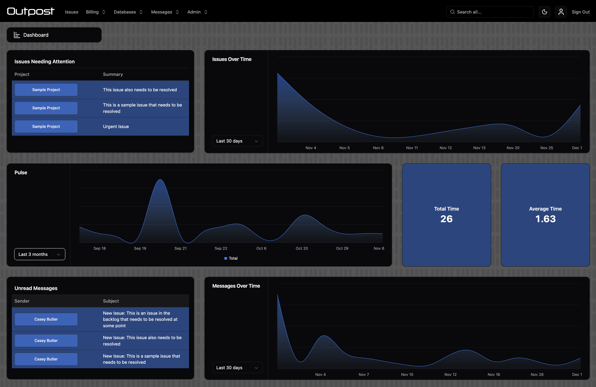

Your app's global config file is found at `src/main.ts`.

This file defines project-wide config for your app.

You can use [application state](/docs/api-reference/Application%20State) and the [Web](/docs/api-reference/Web%20SDK) and [Node](/docs/api-reference/Node%20SDK) SDKs in this file.

## General

### roles 

`string[]`

This is the big one. Name the access roles that will be used in your app. Each role will have its own permissions.

For example: `["Manager", "Supervisor", "Staff Member", "Client"]`

### appName

`string | (() => string | Promise<string>)`

The name of your app. Shorter is better, as this will be used for page titles etc.

### timezone

`string | (() => string | Promise<string>)`

Your app will be based in this timezone.

Must be a valid IANA timezone.

### disabledCollections

`string[]`

An array of collection names that will be disabled in your app (on the next `stoker deploy`).

### enableUserIDLogging

Whether to log the user's ID in the client whenever Firebase prints logs. This can be useful for debugging, but may cause privacy concerns in some scenarios. For this reason, we disable it by default.

## Auth Config

Auth config is specified using the `auth` property.

### enableMultiFactorAuth

`string[]`

An array of roles. App users with these roles will have the option to enable multi factor auth (using an Authenticator app).

### authPersistenceType

`"LOCAL" | "SESSION"| "NONE" | (() => "LOCAL" | "SESSION" | "NONE" | Promise<"LOCAL" | "SESSION" | "NONE">)`

The auth persistence strategy for your app.

`"LOCAL"`: Auth state is persisted across sessions. The user will stay logged in even when the window is closed or refreshed.

`"SESSION"`: Auth state is persisted within the same session. The user will be logged out when the window is closed.

`"NONE"`: Auth state is not persisted. The user will be logged out when the window is closed or refreshed.

### offlinePersistenceType

`"ALL" | "WRITE" | "NONE" | ((user: User, claims: ParsedToken) => "ALL" | "WRITE" | "NONE" | Promise<"ALL" | "WRITE" | "NONE">)`

The offline persistence strategy for your app.

#### Parameters

`user`: The currently logged in [Firebase User](https://firebase.google.com/docs/reference/js/auth.user)

`claims`: A Firebase Auth [ParsedToken](https://firebase.google.com/docs/reference/js/auth.parsedtoken). The custom claims for the user, for example `role`, can be found here.

#### Return

`"ALL"`: All data read and written is stored in IndexedDB and persisted across sessions. Offline writes will be retried when the connection is restored, even if the window is closed while still offline. 

:::danger
This strategy creates a security risk if your app is used on public computers, as app data is stored in IndexedDB beyond the user's session.
:::

`"WRITE"`: Writes are persisted across sessions. Offline writes will be retried when the connection is restored, even if the window is closed while still offline. [`enableWriteLog`](/docs/api-reference/Collection%20Config%20Files#enablewritelog) must be set to `true` for offline persitent writes to work for a collection.

:::warning
This strategy creates a security risk if your app is used on public computers, as app data is stored in IndexedDB beyond the user's session. However, this option is more secure than `"ALL"` because read data is not persisted.
:::

`"NONE"`: No offline persistence. Offline writes will fail if the window is closed before the connection is restored.

### signOutOnPermissionsChange

`boolean`

Set to `true` to sign out a user when they're permissions are changed. If falsy, the Admin UI will attempt to reload data affected by the permissions change.

### clearPersistenceOnSignOut

`boolean`

Only relevant if `auth.offlinePersistenceType` is set to `"ALL"` or `"WRITE"`.

Set to `true` to clear offline persistence data from IndexedDB on sign out.

:::warning
The Firebase team does not recommend relying on this method for security purposes.
:::

### tabManager

`"SINGLE" | "MULTI"`

Only relevant if `auth.offlinePersistenceType` is set to `"ALL"` or `"WRITE"`.

Whether to use offline persisted data across tabs.

Defaults to `"MULTI"`.

If set to `"SINGLE"`, offline persistence will only be available in the first tab opened.

### garbageCollectionStrategy

`"LRU" | "EAGER"`

Only relevant if `auth.offlinePersistenceType` is set to `"WRITE"` or `"NONE"`.

The garbage collection strategy to use for in-memory data. We highly recommend using LRU.

Defaults to `"LRU"`.

### maxCacheSize

`number`

The maximum cache size for in-memory (`"LRU"` only) and persisted (`"ALL"` or `"WRITE"` only) caches.

Use `-1` to set an unlimited cache size.

Defaults to `-1`

### maxWriteCacheSize

`number`

Overwrites `auth.maxCacheSize` above for the write database instance only.

Use `-1` to set an unlimited cache size.

Defaults to `-1`

## Admin UI Config

### access

`string[] | (() => string[])`

If defined, only the roles listed will be able to see the Admin UI.

:::warning
This access restriction is only enforced on the client. Users can still log in, but they won't see anything.
:::

### background

```
type Background = {
    light?: {
        color: string
        image?: string
    }
    dark?: {
        color: string
        image?: string
    }
}

```

`Background | (() => Background)`

Return `Background` objects for light and dark mode. This lets you control the background properties of the `body`.

### logo

`{ navbar?: string login?: string }`

Return image urls to be used for the navbar title and the login page. If not provided, the icons in your `icons` directory will be used.

### menu.groups

```
type MenuGroup = {
    title: string
    position: number
    collections: string[]
    roles?: string[]
}
```

`MenuGroup[]`

Return an array of `MenuGroup` objects defining the menu structures for the user roles in your system.

See the default "Messages" menu group in your project for an example.

### dateFormat

`string | (() => string)`

The [Luxon date format](https://moment.github.io/luxon/#/formatting?id=table-of-tokens) to display dates in.

### meta

```
type MetaIcon = {
    rel: string
    type: string
    url: string
}

i.e. <link key="favicon" rel="icon" type="image/png" href="./favicon.ico" />
```

`{ description?: string, icons?: MetaIcon[] }`

Define the meta tag description and icons for your app's home page.

### homePage

`Record<string, string> | (() => Record<string, string>)`

Return a set of key/value pairs defining user roles and the collection that will act as their homepage.

If the user role has access to the Dashboard, that will take precedence.

For example:

```
{
    Manager: "Projects",
    Client: "Invoices,
}
```

### dashboard



`DashboardItem[]`

Return an array of Dashboard Items. These will be laid out in a grid.

We recommend that each row contains 1-2 metrics and a chart OR 1 reminder and a chart.

Display a metric (numerical counter):
```
type DashboardMetric = {
    kind: "metric"
    collection: string
    type: "sum" | "average" | "count"
    field?: string
    roles?: string[]
    title?: string
    decimal?: number
    prefix?: string
    suffix?: string
    textSize?: "text-xl" | "text-2xl" | "text-3xl"
}
```

Display a chart:
```
type DashboardChart = {
    kind: "chart"
    collection: string
    type: "area"
    dateField: string
    metricField1?: string
    metricField2?: string
    defaultRange: "90d" | "30d" | "7d"
    roles?: string[]
    title?: string
}
```


Display a reminder (a list of pertinent records):
```
type DashboardReminder = {
    kind: "reminder"
    collection: string
    columns: string[]
    title?: string
    roles?: string[]
    constraints?: [string, WhereFilterOp, unknown][]
    sort?: {
        field: string
        direction: "asc" | "desc"
    }
}
```

## Firebase Config

Firebase config is specified using the `firebase` property.

### enableEmulators

`boolean | (() => boolean | Promise<boolean>)`

Enable or disable the Firebase Emulators. The default value is a function that enables the emulators in development mode, which is necessary for `npm run start` to function properly. You can disable the emulators in development mode to use your live back end in development.

### enableAnalytics

`boolean | (() => boolean | Promise<boolean>)`

Enable or disable Google Analytics for your app.

The default value is a function that enables analytics in production mode.

### analyticsSettings

`AnalyticsSettings | (() => AnalyticsSettings | Promise<AnalyticsSettings>)`

[Google Analytics config](https://firebase.google.com/docs/reference/js/analytics.analyticssettings.md#analyticssettings_interface)

### analyticsConsentSettings

`ConsentSettings | (() => ConsentSettings | Promise<ConsentSettings>)`

[Google Analytics consent config](https://firebase.google.com/docs/reference/js/analytics.consentsettings)

### serverTimestampOptions

`"none" | "estimate" | "previous" | (() => "none" | "estimate" | "previous" | Promise<"none" | "estimate" | "previous">)`

The [strategy to use for Firestore server timestamps](https://firebase.google.com/docs/reference/js/firestore_.snapshotoptions).

We recommend setting this to `"estimate"`

Defaults to `"none"`

### logLevel.dev

`"debug" | "verbose" | "info" | "warn" | "error" | "silent"`

The Firebase log level for development mode.

### logLevel.prod

`"debug" | "verbose" | "info" | "warn" | "error" | "silent"`

The Firebase log level for production mode.

### writeLogTTL

`number`

If set, this is the number of days after which [write log](/docs/api-reference/Collection%20Config%20Files#enablewritelog) entries will be deleted. We recommend leaving it out in order to keep records of write activity indefinitely. However, you may wish to reduce your storage costs by deleting write logs after a certain number of days.

### permissionsIndexExemption

`boolean`

Exempt the user permissions collection from Cloud Firestore. We recommend setting this to `true` for performance reasons, however you will need to set it to falsy in order to query the permissions collection by specific fields.

### writeLogIndexExemption

`string[]`

Exempt individual fields from the write log. We recommend leaving this as an empty array unless you have a good reason to exempt fields.

### GDPRSettings

`boolean | (() => boolean | Promise<boolean>)`

[The settable config flag for GDPR opt-in/opt-out](https://firebase.google.com/docs/reference/js/app.firebaseapp.md#firebaseappautomaticdatacollectionenabled)

## Preload Cache Config

[Preload cache](/docs/api-reference/Collection%20Config%20Files#preload-cache-config) config is specified using the `preload` property.

### async

`string[] | (() => string[] | Promise<string[]>)`

An array of collection names that have the preload cache enabled. These collections will be preloaded first, in parallel.

### sync

`string[] | (() => string[] | Promise<string[]>)`

An array of collection names that have the preload cache enabled. These collections will be preloaded synchronously while the async collections above also load. Collections not listed in `preload.async` or `preload.sync` will load synchronously after the collections in this list.

## Mail Config

Mail config is specified using the `mail` property.

### emailVerification

`(verificationLink: string, appName?: string) => { subject: string html: string }`

Customize the email address verification email sent out to your app's users.

#### Parameters

`verificationLink`: The verification link that the user will click to verify their email address.

`appName`: The app name you provided in `appName` above.

#### Return

An object with a `subject` and a `html` message that will be sent to the user.

## Global Hooks

:::info
When importing modules that are web-only or server-only, be sure to:

1. Install them using [`external.packages.json`](Other%20Project%20Files#install-custom-npm-packages)
2. Guard their use by wrapping code in: 
    ```
    if(sdk === "web") { 
        ...your web code goes here...
    }
    if(sdk === "node") { 
        ...your server code goes here...
    }
    ```
3. Import them dynamically i.e. `await import("firebase/firestore")`

This lets you write web and server code in the same file.

You can also write your own modules in the `src/web` and `src/node` folders and import modules statically there. In this case, you can only use one import per line i.e. `import { getFirestore } from "firebase/firestore"`
:::

:::danger
**Server code protection:** During the build process, server-only code blocks are automatically stripped from the client bundle:

- `if(sdk === "node")` blocks are removed
- `else` and `else if` blocks following `if (sdk === "web")` guards are removed
- Code in `src/node` is stripped to export names only

**Important:** Code outside of these guard blocks WILL be sent to the client and will run on the client.

For highly sensitive server operations, consider using [custom cloud functions](Other%20Project%20Files#custom-cloud-functions) instead.
:::

### preLogin

`(user: User) => boolean | void | Promise<boolean | void>`

Fires before the user is logged in, prior to any other authentication logic being processed. You may block the sign in by returning `false`.

#### Parameters

`user`: The currently logged in [Firebase User](https://firebase.google.com/docs/reference/js/auth.user)

:::warning
This logic is client-side and is skippable. If you want to securely perform sign-in-blocking operations, use [Firebase Auth Blocking Cloud Functions](https://firebase.google.com/docs/auth/extend-with-blocking-functions).
:::

#### Return

A boolean defining whether or not the user may proceed with login.

### postLogin

`(user?: User, error?: unknown) => void | Promise<void>`

Fires after the user has successfully logged in.

#### Parameters

`user`: The currently logged in [Firebase User](https://firebase.google.com/docs/reference/js/auth.user)

### preLogout

Fires when the user attempts to log out. You may block the sign out by returning `false`.

`(user: User) => boolean | void | Promise<boolean | void>`

#### Parameters

`user`: The currently logged in [Firebase User](https://firebase.google.com/docs/reference/js/auth.user)

#### Return

A boolean defining whether or not the user may proceed with sign out.

### postLogout

```
(
    errorDetails: {
        error: boolean
        instances: {
            instance: "[DEFAULT]" | "firestoreWrite"
            code: "SIGN_OUT" | "TERMINATE_APP" | "CLEAR_CACHE"
            error: unknown
        }[]
    }
) => void | Promise<void>
```

Fires when the user has logged out. If an error is encountered during sign out, additional information is provided describing:
- Which Firestore instances encountered the error
- The operation that encountered the error for each affected instance
- The error itself for each affected instance

### preOperation

```
(
    operation: "read" | "create" | "update" | "delete",
    data?: StokerRecord,
    docId?: string,
    context?: any,
    batch?: WriteBatch,
    originalRecord?: StokerRecord
) => boolean | void | Promise<boolean | void>
```

Fires before all read and write operations.

Return `false` to cancel the operation.

### preRead

```
(
    context: any,
    refs: unknown[],
    multiple?: boolean,
    listener?: boolean,
) => void | Promise<void>
```

Fires before all read operations.


### preValidate

```
(
    operation: "create" | "update",
    record: StokerRecord,
    context: any,
    batch?: WriteBatch,
    originalRecord?: StokerRecord,
) => { valid: boolean; message?: string } | Promise<{ valid: boolean; message?: string }>
```

Fires at write validation time for all write operations. This is where you can define custom validation logic.

Return an object with a boolean indicating whether validation passed, and a message to display to the user if validation has failed.

### preWrite

```
(
    operation: "create" | "update" | "delete",
    data: StokerRecord,
    docId: string,
    context: any,
    batch?: WriteBatch,
    originalRecord?: StokerRecord,
) => boolean | void | Promise<boolean | void>
```

Fires before all write operations.

Return `false` to cancel the operation.

### preDuplicate

`(data: Partial<StokerRecord>) => boolean | void | Promise<boolean | void>`

Fires before all duplicate operations in the Admin UI.

Return `false` to cancel the operation.

### postOperation

```
(
    operation: "read" | "create" | "update" | "delete",
    data?: StokerRecord,
    docId?: string,
    context?: any,
    retry?: boolean,
    originalRecord?: StokerRecord,
) => void | Promise<void>
```

Fires after all read and write operations.

### postRead

```
(
    context: any,
    refs: unknown[],
    doc: StokerRecord | undefined,
    listener?: boolean,
) => void | Promise<void>
```

Fires after all read operations.

### postWrite

```
(
    operation: "create" | "update" | "delete",
    data: StokerRecord,
    docId: string,
    context: any,
    retry?: boolean,
    originalRecord?: StokerRecord,
) => void | Promise<void>
```

Fires after all write operations.

### postWriteError

```
(
    operation: "create" | "update" | "delete",
    data: StokerRecord,
    docId: string,
    context: any,
    error: unknown,
    retry?: boolean,
    retries?: number,
    originalRecord?: StokerRecord,
) => void | Promise<void>
```

Fires when a write operation encounters an error.

We provide a default function for this hook. The default function sends you an email whenever an error is encountered.

This hook may file multiple times per write, so be sure to write idempotent code.

### preFileAdd

```
(
    record: StokerRecord,
    fullPath: string,
    filename: string,
    permissions: FilePermissions,
) => boolean | void | Promise<boolean | void>
```

Fires before a file is uploaded.

Return `false` to cancel the operation.

### preFileUpdate

```
(
    record: StokerRecord,
    update:
        { type: "rename"; oldPath: string; newPath: string } |
        {
            type: "permissions"
            path: string
            originalPermissions: FilePermissions
            permissions: FilePermissions
        },
) => boolean | void | Promise<boolean | void>
```

Fires before a file is updated.

Return `false` to cancel the operation.

### postFileAdd

```
(
    record: StokerRecord,
    fullPath: string,
    filename: string,
    permissions: FilePermissions,
) => void | Promise<void>
```

Fires after a file is uploaded.

### postFileUpdate

```
(
    record: StokerRecord,
    update:
        { type: "rename"; oldPath: string; newPath: string } |
        {
            type: "permissions"
            path: string
            originalPermissions: FilePermissions
            permissions: FilePermissions
        },
) => void | Promise<void>
```

Fires after a file is updated.

### onVersionUpdate

```
(
    versionInfo: {
        version: number
        force: boolean
        refresh: boolean
        time: Timestamp | FieldValue
        payload: unknown
    }, numberOfUpdates: number
) => void | Promise<void>
```

Fires when the schema version is updated.

:::warning
If `refresh` is `true` for the schema update, the page will automatically refresh and this hook will not fire.
:::

### onMaintenanceUpdate

`(status: "on" | "off") => void | Promise<void>`

Fires when maintenance mode is engaged / disengaged.

### onConnectionStatusChange

`(status: "Online" | "Offline", first: boolean) => void | Promise<void>`

Fires when the app goes online / offline.

`first` will be true for the initial value read on app startup.

### onFirestoreSlowConnection

`() => void | Promise<void>`

Fires when Cloud Firestore detects a slow internet connection.

### onFirestoreLoadFailure

`() => void | Promise<void>`

Fires when Cloud Firestore experiences a read failure, usually due to excessive contention on documents or exceeded quotas.

### onIndexedDBConnectionLost

`() => void | Promise<void>`

Fires in rare cases where Firestore IndexedDB persistence fails.

### onAppCheckTokenFailure

`(error: FirebaseError) => void | Promise<void>`

Fires when App Check token refresh fails.


